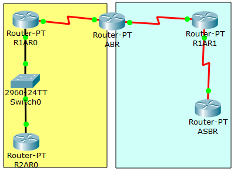

# Практика по OSPF

> Я только начал, я еще не закончил

Я скачал с сайта 2 практику [Сборка сети](http://solod.zz.mu/edu/inet/2_OSPF/ospf_multiarea_0.pkt), несколько областей, часть 1. Насколько я понял, то начинать нужно с шага 7.



Включим RIPv2

```
R2AR0(config)#router rip
R2AR0(config-router)#version 2
R2AR0(config-router)#no auto-summary 
R2AR0(config-router)#exit
```

Поднимем loopback интерфейсы:

```
R2AR0(config)#interface loopback 2
R2AR0(config-if)#ip address 172.20.0.1 255.255.255.0
R2AR0(config-if)#ip address 172.20.1.1 255.255.255.0
R2AR0(config-if)#ip address 172.20.2.1 255.255.255.0
```

Если посмотреть таблицу маршрутизации на роутере R2AR0, то можно увидеть, что он знает только о тех сетях, которые работают на OSPF:

```
R2AR0#show ip route 
Codes: C - connected, S - static, I - IGRP, R - RIP, M - mobile, B - BGP
       D - EIGRP, EX - EIGRP external, O - OSPF, IA - OSPF inter area
       N1 - OSPF NSSA external type 1, N2 - OSPF NSSA external type 2
       E1 - OSPF external type 1, E2 - OSPF external type 2, E - EGP
       i - IS-IS, L1 - IS-IS level-1, L2 - IS-IS level-2, ia - IS-IS inter area
       * - candidate default, U - per-user static route, o - ODR
       P - periodic downloaded static route

Gateway of last resort is not set

     10.0.0.0/8 is variably subnetted, 7 subnets, 2 masks
O       10.1.1.0/24 [110/65] via 10.2.2.1, 00:19:29, FastEthernet0/0
C       10.2.2.0/24 is directly connected, FastEthernet0/0
C       10.3.3.0/24 is directly connected, Serial2/0
C       10.10.0.1/32 is directly connected, Loopback0
C       10.10.1.1/32 is directly connected, Loopback1
C       10.10.2.1/32 is directly connected, Loopback2
C       10.10.3.1/32 is directly connected, Loopback3
O IA 192.168.1.0/24 [110/129] via 10.2.2.1, 00:19:19, FastEthernet0/0
O IA 192.168.2.0/24 [110/193] via 10.2.2.1, 00:19:19, FastEthernet0/0
```

Что-то аналогичное мы видем у  TRRIP:

```
R2AR0#show ip route
Codes: C - connected, S - static, I - IGRP, R - RIP, M - mobile, B - BGP
       D - EIGRP, EX - EIGRP external, O - OSPF, IA - OSPF inter area
       N1 - OSPF NSSA external type 1, N2 - OSPF NSSA external type 2
       E1 - OSPF external type 1, E2 - OSPF external type 2, E - EGP
       i - IS-IS, L1 - IS-IS level-1, L2 - IS-IS level-2, ia - IS-IS inter area
       * - candidate default, U - per-user static route, o - ODR
       P - periodic downloaded static route

Gateway of last resort is not set

     10.0.0.0/8 is variably subnetted, 4 subnets, 2 masks
C       10.3.3.0/24 is directly connected, Serial2/0
C       10.10.0.1/32 is directly connected, Loopback0
C       10.10.1.1/32 is directly connected, Loopback1
C       10.10.3.1/32 is directly connected, Loopback3
     172.20.0.0/24 is subnetted, 1 subnets
C       172.20.2.0 is directly connected, Loopback2
```

### Настройка маршрутов из OSPF в RIP 

На роутере R2AR0  вводим:

```
R2AR0(config)#router rip 
R2AR0(config-router)#redistribute ospf 1 metric 5
R2AR0(config-router)#exit
```

### Настройка маршрутов из RIP в OSPF

Чтобы настроить передачу маршрутов из RIP в OSPF воспользоваться командой `redistribute rip subnets`

полезные ссылки для себя: 

- http://www.foxnetwork.ru/files/LABS/RIP/lab_rip_normal_ru.pdf
- http://infocisco.ru/cheatsheet_dinamic_routing_protocol_rip.html
- http://www.smartpctricks.com/2014/04/redistribution-between-rip-and-ospf.html