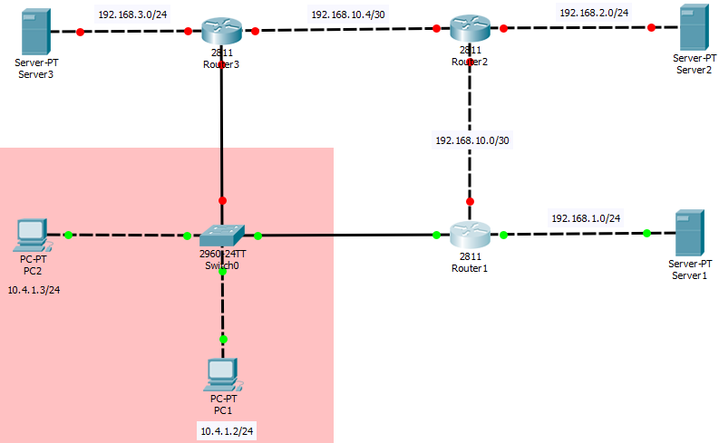
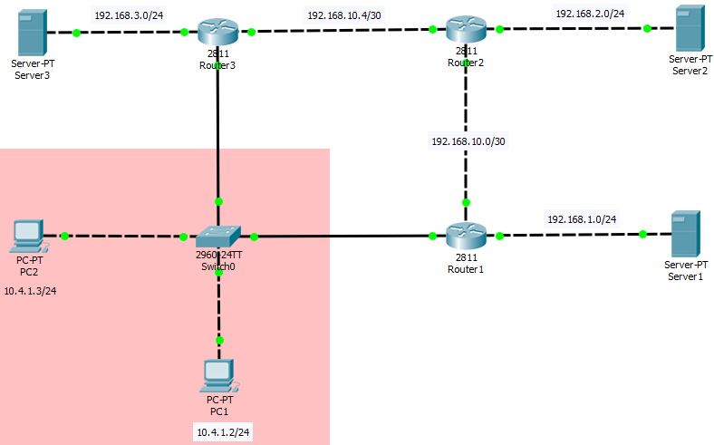
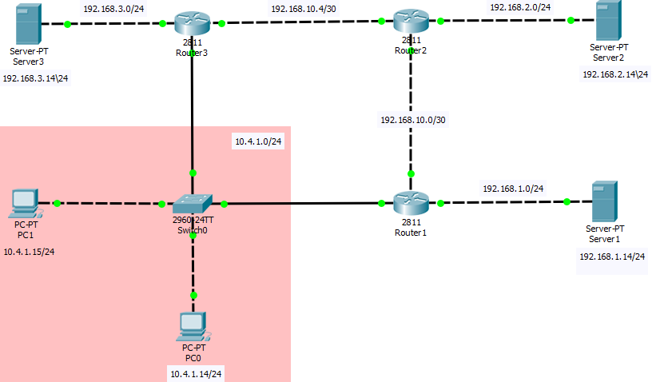

# Практика. RIP

Студент ФТ-201 Волков Денис. В моем случае, n = 4.

На первом этапе я собрал сеть как на картинке. Подключил нужную плату(**NM-1FE-TX**) на роутерах. Настроил IP адреса на комьютерах PC1 и PC2.

Теперь поднимем интерфейсы на Rounter1.

```
Router>enable
Router#conf t
Router(config)#int fa0/0
Router(config-if)#ip address 192.168.10.1 255.255.255.252
Router(config-if)#no shutdown
Router(config-if)#exit

Router#conf t
Router(config)#int fa0/1
Router(config-if)#ip address 10.4.1.1 255.255.255.0
Router(config-if)#no shutdown
Router(config-if)#exit

Router(config)#int fa1/0
Router(config-if)#ip address 192.168.1.1 255.255.255.0
Router(config-if)#no shutdown
Router(config-if)#exit
```

 Стало теперь так



Аналогичным образом настроим Rounter2 и Rounte3 согласно таблице (маршрутизации?)

```
Rounter2

Router(config)#int fa0/0
Router(config-if)#ip address 192.168.10.2 255.255.255.252
Router(config-if)#no shutdown
Router(config-if)#exit

Router(config)#int fa0/1
Router(config-if)#ip address 192.168.10.6 255.255.255.252
Router(config-if)#no shutdown
Router(config-if)#exit

Router(config)#int fa1/0
Router(config-if)#ip address 192.168.2.1 255.255.255.0
Router(config-if)#no shutdown
Router(config-if)#exit

Rounter3

Router(config)#int fa0/0 
Router(config-if)#ip address 10.4.1.2 255.255.255.0
Router(config-if)#no shutdown
Router(config-if)#exit

Router(config)#int fa0/1
Router(config-if)#ip address 192.168.10.5 255.255.255.252
Router(config-if)#no shutdown
Router(config-if)#exit

Router(config)#int fa1/0
Router(config-if)#ip address 192.168.3.1 255.255.255.0
Router(config-if)#no shutdown
Router(config-if)#exit
```

Теперь имеем следующее:



На этом этапе я увидел, что неправильно выбрал IP-адреса для компьютеров. Вернул им старые названия. Задал IP-адреса для серверов.



Шлюз по умолчанию для PC0, PC1 (устанавливаю на Switch0) - Router1.(http://www.techexams.net/forums/ccna-ccent/50919-default-gateway-packet-tracer-switch.html)

```
Switch(config)#ip default-gateway 192.168.10.1
```

Конфигурация RIP для Rounter1: (https://www.sysnettechsolutions.com/en/ciscopackettracer/configure-rip-routing-in-cisco-packet-tracer/)

```
Router(config)#router rip 
Router(config-router)#network 192.168.10.0
Router(config-router)#network 10.4.1.0
Router(config-router)#network 192.168.1.0
Router(config-router)#end
```

Конфигурация RIP для Router 2:

```
Router(config)#router rip
Router(config-router)#network 192.168.10.0
Router(config-router)#network 192.168.10.4
Router(config-router)#network 192.168.2.0
Router(config-router)#end
```

Конфигурация RIP для Router 3:

```
Router(config)#router rip
Router(config-router)#network 10.4.1.0
Router(config-router)#network 192.168.10.4
Router(config-router)#network 192.168.3.0
Router(config-router)#end
```

Теперь, например, посмотрим rip database:

```
Router1:

Router#show ip rip database 
10.4.1.0/24    auto-summary
10.4.1.0/24    directly connected, FastEthernet0/1
192.168.1.0/24    auto-summary
192.168.1.0/24    directly connected, FastEthernet1/0
192.168.10.0/30    auto-summary
192.168.10.0/30    directly connected, FastEthernet0/0

Router# show ip interface brief
Interface              IP-Address      OK? Method Status                Protocol 
FastEthernet0/0        192.168.10.1    YES manual up                    up 
FastEthernet0/1        10.4.1.1        YES manual up                    up 
FastEthernet1/0        192.168.1.1     YES manual up                    up 
Vlan1                  unassigned      YES unset  administratively down down
```


```
Router2:

Router#show ip rip database 
192.168.2.0/24    auto-summary
192.168.2.0/24    directly connected, FastEthernet1/0
192.168.10.0/30    auto-summary
192.168.10.0/30    directly connected, FastEthernet0/0
192.168.10.4/30    auto-summary
192.168.10.4/30    directly connected, FastEthernet0/1

Router#show ip interface brief
Interface              IP-Address      OK? Method Status                Protocol 
FastEthernet0/0        192.168.10.2    YES manual up                    up 
FastEthernet0/1        192.168.10.6    YES manual up                    up 
FastEthernet1/0        192.168.2.1     YES manual up                    up 
Vlan1                  unassigned      YES unset  administratively down down
```


```
Router3:

Router#show ip rip database 
10.4.1.0/24    auto-summary
10.4.1.0/24    directly connected, FastEthernet0/0
192.168.3.0/24    auto-summary
192.168.3.0/24    directly connected, FastEthernet1/0
192.168.10.4/30    auto-summary
192.168.10.4/30    directly connected, FastEthernet0/1

Router#show ip interface brief
Interface              IP-Address      OK? Method Status                Protocol 
FastEthernet0/0        10.4.1.2        YES manual up                    up 
FastEthernet0/1        192.168.10.5    YES manual up                    up 
FastEthernet1/0        192.168.3.1     YES manual up                    up 
Vlan1                  unassigned      YES unset  administratively down down
```

Сохранил настройки каждого маршрутизатора командой `w m`.


UPDATE:

мне подсказали, что у меня неправильно был настроен default-gateway и ip-адреса у Router 1

```
Router(config)#int fa0/0
Router(config-if)#ip address 10.4.1.1 255.255.255.0
Router(config-if)#no shutdown
Router(config-if)#exit

Router(config-if)#int fa0/1
Router(config-if)#ip address 192.168.1.1 255.255.255.0
Router(config-if)#no shutdown 
Router(config-if)#exit

Router(config)#int fa1/0
Router(config-if)#ip address 192.168.10.1 255.255.255.252
Router(config-if)#no shutdown
Router(config-if)#exit 
```

```
Switch(config)#ip default-gateway 10.4.1.1
```


