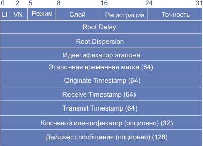

# Сервер точного времени

Сервер точного времени, который «врет» на заданное в своем конфигурационном файле число секунд. Сервер прослушивает 123 порт UDP. Время сервер узнает либо у ОС, либо у другого надежного сервера точного времени, например, time.windows.com. В конфигурационном файле сервера указано, на сколько секунд он должен «врать», т. е. из точного времени сервер вычитает или прибавляет указанное число секунд.

## TO DO:

- asyncio

#  Протокол SNTP

**SNTP** (Simple Network Time Protocol) — протокол синхронизации времени по компьютерной сети. Является упрощённой реализацией протокола NTP. Используется во встраиваемых системах и устройствах, не требующих высокой точности, а также в пользовательских программах точного времени. SNTP протокол является частным случаем NTP протокола с некоторыми упрощениями. Таким образом SNTP клиент может обращаться к любому NTP серверу, как к серверу SNTP.

## Временные метки

В протоколе SNTP используется одинаковый с протоколом NTP формат представления времени — 64-битное число, состоящее из 32-битного счётчика секунд и 32-битного счётчика долей секунд. Нулевое значение счётчика времени соответствует нулю часов 1 января 1900 г., 6 ч 28 м 16 с 7 февраля 2036 г. и т. д

Максимальное число, которое может быть представлено в данном формате равно 4,294,967,295 секунд с точностью порядка 200 пикосекунд, что может удовлетворить самым экзотическим требованиям.

Заметим что с некоторого времени в 1968 (2,147,483,648 секунда) старший бит (бит 0 целочисленной части) стал равным 1 и 64-битовое поле переполнится в 2036 году. Если NTP или SNTP будут использоваться в 2036 г, будут необходимы некоторые внешние по отношению к данному протоколу меры для определения того относительно 1900 или 2036 года отсчитана приведенная дата (это справедливо и для других дат, кратных 136 годам).

## Формат сообщений

Протоколы NTP и SNTP используют в качестве транспортного протокол UDP. При этом работает UDP-порт 123 (NTP), который проставляется как в поле порта отправителя, так и получателя UDP-заголовка.

Ниже приводится описание формата сообщений NTP/SNTP v.4, которые размещаются после UDP-заголовка. Этот формат идентичен описанному в [RFC-4330](https://tools.ietf.org/html/rfc4330), за исключением содержимого поля идентификатора эталона (reference identifier). 

### Поле LI (Leap Indicator)

Поле **LI** (Leap Indicator) содержит два бита кода предупреждения о добавлении/удалении секунды в последней минуте текущего дня. Значения кодов поля LI приведены в таблице:

| LI   | Величина | Значение                                 |
| ---- | -------- | ---------------------------------------- |
| 00   | 0        | предупреждения нет                       |
| 01   | 1        | последняя минута содержит 61 секунду     |
| 10   | 2        | последняя минута содержит 59 секунд      |
| 11   | 3        | аварийный сигнал (часы не синхронизованы |

### Поле VM (Version Number)

Поле **VN** (Version Number - номер версии) имеет длину три бита и содержит номер версии протокола NTP/SNTP. Это поле содержит 3 для V.3 (только IPv4) и 4 для V.4 (IPv4, IPv6 и OSI).

### Поле режим

Поле **режим** также содержит три бита и указывает на код режима. Значения кодов режима представлены в таблице.

| Режим | Значение                                 |
| ----- | ---------------------------------------- |
| 0     | зарезервировано                          |
| 1     | симметричный активный                    |
| 2     | симметричный пассивный                   |
| 3     | клиент                                   |
| 4     | сервер                                   |
| 5     | широковещательный                        |
| 6     | для управляющих сообщений NTP            |
| 7     | зарезервировано для частного использования |

В уникастном и эникастном режиме клиент при запросе устанавливает это поле равным 3 (клиент), а сервер в отклике устанавливает его равным 4. В мультикастном режиме сервер записывает в данное поле код 5 (широковещательный).

### Поле слой (Stratum)

Поле **слой** (Stratum) содержит восемь бит, указывающих на уровень локальных часов. Значения кодов поля слой представлены в таблице:

| Слой   | Значение                                |
| ------ | --------------------------------------- |
| 0      | не специфицирован или не доступен       |
| 1      | первичный эталон (например, радио часы) |
| 2-15   | вторичный эталон (через NTP или SNTP)   |
| 16-255 | зарезервировано на будущее              |

### Поле интервал запросов

Поле интервал запросов (Poll Interval - регистрация) содержит 8 бит и указывает на максимальный интервал между последовательными сообщениями. Код (k) характеризует показатель степени 2. Интервал между запросами равен 2^k секунд. Значения, которые могут появиться в этом поле лежат в диапазоне от 4 (16 сек) до 14 (16284 сек); однако большинство приложений использует субдиапазон от 6 (64 сек.) до 10 (1024 сек).

### Поле точность 

Поле точность содержит 8 бит и характеризует точность локальных часов, в секундах (показатель степени 2, как и в предыдущем поле). Значения кодов в этом поле лежат в диапазоне -6 для частоты сети переменного тока до -20 для микросекундных часов.

### Поле Root Delay

Поле Root Delay представляет собой 32-битовое число с фиксированной запятой, характеризующее RTT в секундах до эталона точного времени. Запятая в этом числе располагается между битами 15 и 16. Заметим, что эта переменная может быть положительной или отрицательной. Диапазон значений кодов этого поля лежит в диапазоне от минус нескольких миллисекунд до плюс нескольких сотен миллисекунд.

### Поле Root Dispersion

Поле Root Dispersion представляет собой 32-битовое число без знака с фиксированной запятой, указывающее на номинальное значение временной ошибки относительно эталона в секундах. Разброс значений этого поля лежит в пределах от нуля до нескольких сот миллисекунд.

### Поле идентификатор эталона

Поле идентификатор эталона представляет собой 32-битовую строку, которая позволяет однозначно идентифицировать эталон времени. В случае первичных серверов (слой 0 или 1) NTP V.3 или V.4, идентификатор представляет собой четырех символьную ASCII-строку, размещенную в левой части поля. Свободная часть поля заполняется нулями. Для вторичных серверов NTP V.3, идентификатор равен 32-битовому адресу эталонного источника (IPv4). Для вторичных серверов NTP V.4, в качестве идентификатора используются младшие 32 бита последней временной метки эталонного источника. Первичные серверы NTP (слой 1) должны заносить в это поле коды, идентифицирующие внешние эталоны согласно таблице 4.4.16.4. Если код в таблице отсутствует, допускаются и другие коды.

(эта таблица не нужна мне)

### Важные поля

Поле **эталонная временная метка** характеризует время, когда локальные часы были установлены или поправлены (64-битовый формат временной метки).

Поле **Originate Timestamp (исходная временная метка)** соответствует времени, когда клиент направил запрос серверу (64-битовый формат временной метки).

Поле **Receive Timestamp** характеризует время, когда запрос пришел на сервер (64-битовый формат временной метки).

Поле **Transmit Timestamp** соответствует времени, когда сервер послал отклик клиенту (64-битовый формат временной метки).

Поле **аутентификатор** (опционно) используется, когда необходима аутентификация, и содержит в себе ключевой идентификатор и сообщение.

Поле **дайджест** хранит код аутентификации сообщения MAC (Message Authentication Code).

## Работа клиента SNTP

