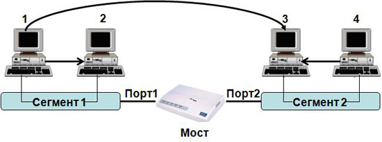
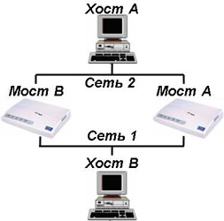

# Канальный уровень 2. STP

Протокол связующего (остовного) дерева (Spanning Tree Protocol, STP) позволяет автоматически отключать дублирующие соединений в Ethernet, чтобы в сети не образовалось кольца и широковещательного шторма.

## Описание протокола 

Протокол работает на канальном уровне. STP позволяет делать топологию избыточной на физическом уровне, но при этом логически блокировать петли. Достигается это с помощью того, что STP отправляет сообщения **BPDU** (Bridge Protocol Data Unit - фрейм) и обнаруживает фактическую топологию сети. А затем, определяя роли коммутаторов и портов, часть портов блокирует так, чтобы в итоге получить топологию без петель.

Для того чтобы определить какие порты заблокировать, а какие будут передавать данные, STP выполняет следующее:

1. Выбор корневого моста (Root Bridge)
2. Определение корневых портов (Root Port)
3. Определение выделенных портов (Designated Port)

## Выбор активного пути STP

Порт коммутатора, который имеет кратчайший путь к корневому коммутатору, называется корневым портом. У любого не корневого коммутатора может быть только один корневой порт. Корневой порт выбирается на основе меньшего Root Path Cost - это общее значение стоимости всех линков до корневого коммутатора. Если стоимость линков до корневого коммутатора совпадает, то выбор корневого порта происходит на основе меньшего Bridge ID коммутатора. Если и Bridge ID коммутаторов до корневого коммутатора совпадает, то тогда корневой порт выбирается на основе Port ID.

## Выбор корневого коммутатора 

Корневым становится коммутатор с наименьшим идентификатором моста (Bridge ID).

Только один коммутатор может быть корневым. Для того чтобы выбрать корневой коммутатор, все коммутаторы отправляют сообщения BPDU, указывая себя в качестве корневого коммутатора. Если коммутатор получает BPDU от коммутатора с меньшим Bridge ID, то он перестает анонсировать информацию о том, что он корневой и начинает передавать BPDU коммутатора с меньшим Bridge ID.

В итоге только один коммутатор останется корневым и будет передавать BPDU.

## Отличия тегированного Vlan от нетегерированного

**VLAN** — **Virtual Local Area Network**. Суть технологии заключается в том, что к сетевому кадру (2-й уровень) прибавляется дополнительный заголовок (**tag**), который содержит служебную информацию и **VLAN ID**. Сети с разными **VLAN ID** недоступны друг другу, как если бы они были выполнены из отдельных кабелей и устройств. Значения **VLAN ID** могут быть от 1 — 4095. При этом 1 зарезервирована как **VLAN** по умолчанию.

Исходя из этого **логично предположить** что есть трафик тегированный и нетегированный. 

Тегированный трафик (с идентификатором влана) идет между коммутаторами и серверами. Обычные же компьютеры не понимают тегированный трафик. 

Поэтому на тех портах, которые смотрят непосредственно на рабочие станции или в сеть с неуправляемым коммутатором, выдается нетегированный трафик. Т.е. от сетевого кадра отрезается тег. Это также происходит, если на порту настроен **VLAN ID = 1**.

## Алгоритм прозрачного моста

Алгоритм "прозрачный мост" назван так потому, что присутствие и работа моста являются прозрачными для хостов сети. Прозрачный мост успешно изолирует внутрисегментный трафик, тем самым сокращая трафик, видимый в каждом отдельном сегменте. Это обычно уменьшает время реакции сети, видимое пользователю.

> Мост строит свою адресную таблицу на основе пассивного наблюдения за трафиком, проходящим через его порты. При этом извлекается информация об адресах источников кадров данных. По адресу источника делается вывод о принадлежности конкретного узла тому или иному сегменту сети. Процесс создания адресной таблицы моста можно рассмотреть на примере простой сети, состоящей из двух сегментов

МАС-адрес | Порт
--------- | ----
1 | 1
2 | 1
3 | 2
4 | 2

Каждый порт работает как конечный узел сегмента сети. Изначально мост ничего не знает о том, узлы с какими MAC-адресами подключены к каждому из его портов. Поэтому он передает любой полученный кадр на все свои порты, за исключением того, от которого он был получен. Одновременно с такой передачей мост изучает адрес источника кадра и заполняет свою таблицу коммутации.

Когда на один из интерфейсов моста принят блок данных, мост ищет адрес пункта назначения этого блока данных в своей внутренней таблице. Если таблица содержит взаимосвязь между адресом пункта назначения и любым из портов этого моста, за исключением того, в котором был принят этот блок данных, то блок данных продвигается из указанного порта. Если не найдено никакой взаимосвязи, то блок данных отправляется лавинной адресацией во все порты, кроме порта вхождения блока данных. Широковещательные сообщения и сообщения многопунктовой адресации отправляются лавинной адресацией таким же образом.

**Существенным препятствием**, нарушающим правильную работу алгоритма "прозрачного моста" является наличие **петель** в сети, как это показано на рисунке:

Предположим, что хост А отправляет блок данных в хост В. Оба моста принимают этот блок данных и и делают правильный вывод о том, что машина А находится в сети 2. К сожалению, после того, как машина В примет два экземпляра блока данных машины А, оба моста снова получают этот же блок данных на свои интерфейсы с Сетью 1, т.к. все хосты принимают все сообщения широковещательных LAN. В некоторых случаях мосты затем изменяют свои внутренние таблицы, чтобы указать, что машина А находится в Сети 1. В этом случае при ответе машины В на блок данных машины А оба моста примут, а затем проигнорируют эти ответы, т.к. их таблицы укажут, что данный пункт назначения (машина А) находится в том же сегменте сети, что и источник этого блока данных.

