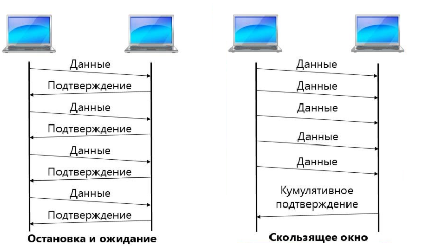
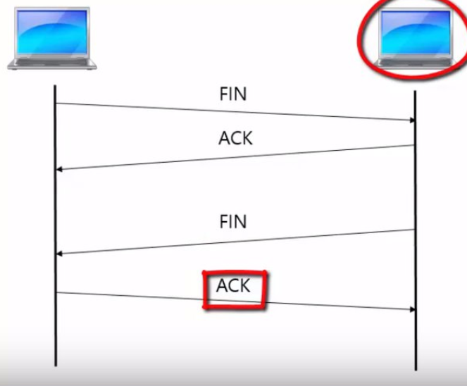

## Установка TCP-соединения

##Порты транспортного уроня: их типы, описание

Хорошо известны порты 1-1024

- 80 - HTTP (Web)
- 25 - SMTP (Электронная почта)
- 53 - DNS
- 67, 68 - DHCP
- Использовать может только Администратор/root

Зарегестрированные порты 49151 - 65535

- автоматически назначаются ОС сетевым приложениям

## Способы подтверждения сообщения

## Окно перезагрузки, окно управления потоком

Управление перезагрузкой (congestion control) в TCP предотвращает отправки в сеть большого количества сегментов, который перегрузят сеть

Механизм реализации

- Окно перегрузки
- Размер определяется динамически

Методы определения размера окна перезагрузки

- Аддитивное увеличение мультиплакативное уменьшение
- Медленный старт

Сигналы о перезагрузке

- Потеря сегмента, задержка сегмента, сигнал от маршрутизатора

## Разрыв соединения

