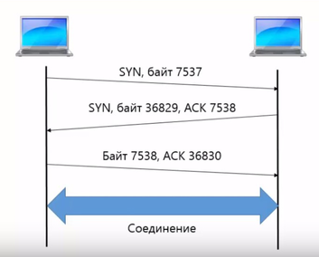
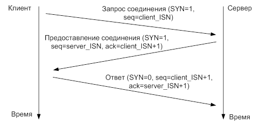
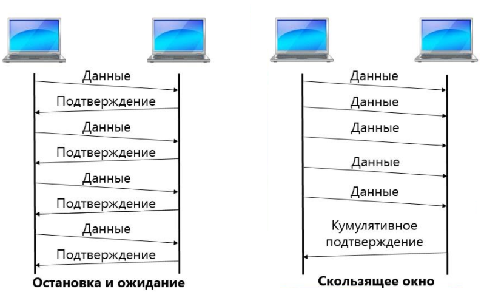

# TCP

**Transmission Control Protocol** (TCP, *протокол управления передачей*) — один из основных протоколов передачи данных интернета, предназначенный для управления передачей данных. Сети и подсети, в которых совместно используются протоколы TCP и IP, называются **сетями TCP/IP**.

В стеке протоколов IP TCP выполняет функции протокола транспортного уровня модели OSI.

> Механизм TCP предоставляет поток данных с предварительной установкой соединения, осуществляет повторный запрос данных в случае потери данных и устраняет дублирование при получении двух копий одного пакета, гарантируя тем самым, в отличие от UDP, целостность передаваемых данных и уведомление отправителя о результатах передачи.

## Установка TCP-соединения

Соединение устанавливается в три этапа (процесс «трёхкратного рукопожатия» TCP):

- Запрашивающая сторона (клиент) **отправляет SYN сегмент**, указывая номер порта сервера, к которому клиент хочет подсоединиться, и исходный номер последовательности клиента (ISN — Initial Sequence Number — начальное значение номера последовательности).
- Сервер **отвечает своим сегментом SYN**, содержащим исходный номер последовательности сервера. Сервер также подтверждает приход SYN клиента с использованием ACK (ISN + 1). На SYN используется один номер последовательности.
- Клиент должен подтвердить приход SYN от сервера своим сегментов SYN, содержащий исходный номер последовательности клиента (ISN+1) и с использованием ACK (ISN+1). Бит SYN установлен в 0, так как соединение установлено.

Более подробно:

## Порты транспортного уроня

> Сетевой уровень нужен для того чтобы информация достигла узла, а транспортный — для того чтобы информация попала нужному приложению в пределах этого узла. Для такой идентификации приложений транспортерные протоколы (как TCP, так и UDP) используют номера портов: каждое приложение, желающее работать с сетью сообщает операционной системе о своих планах и регистрирует за собой какой-то номер порта. В последствии, когда на компьютер придут данные, транспортный уровень заглянет в поле «номер порта получателя» и передаст эти данные соответствующему приложению.

**Порт** — это числовая величина в пределах **от 0 до 65535**, условно диапазоны портов делятся на три категории:

1. **Хорошо известные порты** (well-known ports) — **c 0 по 1023** — эти порты резервируются для самых популярных протоколов и приложений, которые исторически заняли свою нишу. Например, любой веб сервер обычно работает на 80-м порту, почтовый протокол **SMTP использует 25 порт, SSH — 22-ой, DNS-53, DHCP - 67 или 68**.
2. **Зарегистрированные порты** (registered ports) — **с 1024 по 49151** — эти порты могут использоваться менее популярными приложениями, например, сетевыми играми, или более «молодыми» средствами связи, например, Skype. Тем не менее, и в этом блоке есть множество портов, которые можно назвать известными. Например, порт **8080** часто используется как альтернатива порту 80 для HTTP сервера.
3. **Динамические или частные порты** (dynamic or private ports) — **с 49152 по 65535** — так же могут использоваться малоизвестными приложениями, но основное их использование — в качестве порта для клиентских программ. Например, когда вы обращаетесь к веб-серверу, ваш браузер выступает в качестве клиента. При этом на сервере вы будете обращаться к 80-му порту, а данные, приходящие в ответ вашему браузеру идут с 80-го порта на какой-то порт из этого диапазона, который динамически назначился вашему браузеру операционной системой.

На самом деле, разделение портов на диапазоны весьма условно. Обратите внимание, порты существуют и в TCP и в UDP, в каждом из этих диапазонов каждый порт может использоваться обоими протоколами независимо друг от друга.

## Способы подтверждения сообщения

## Окно перезагрузки, окно управления потоком

Управление перезагрузкой (congestion control) в TCP предотвращает отправки в сеть большого количества сегментов, который перегрузят сеть

Механизм реализации

- Окно перегрузки
- Размер определяется динамически

Методы определения размера окна перезагрузки

- Аддитивное увеличение мультиплакативное уменьшение
- Медленный старт

Сигналы о перезагрузке

- Потеря сегмента, задержка сегмента, сигнал от маршрутизатора

## Разрыв соединения

Хотя TCP-соединения являются полнодуплексными, чтобы понять, как происходит их разъединение, лучше считать их парами симплексных соединений. Каждое симплексное соединение разрывается независимо от своего напарника. Чтобы разорвать соединение, любая из сторон может послать TCP-сегмент с установленным в единицу битом FIN, что означает, что у него больше нет данных для передачи. Когда этот TCP-сегмент получает подтверждение, это направление передачи закрывается. Тем не менее, данные могут продолжать передаваться неопределенно долго в противоположном направлении. Соединение разрывается, когда оба направления закрываются.

Если ответ на посланный FIN-сегмент не приходит в течение двух максимальных интервалов времени жизни пакета, отправитель разрывает соединение. Другая сторона в конце концов заметит, что ей никто не отвечает, и также разорвет соединение. Хотя такое решение и не идеально, но на практике проблемы возникают довольно редко.

