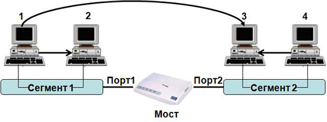
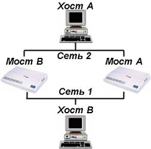

# Протокол STP

Протокол связующего (остовного) дерева (Spanning Tree Protocol, STP) позволяет автоматически отключать дублирующие соединений в Ethernet, чтобы в сети не образовалось кольца и широковещательного шторма.

## Описание протокола 

Чтобы реализовать протокол STP, коммутаторы обмениваются между собой сообщениями, которые называются **Bridge Protocol Data Units(BPDU).** Так как STP был разработан давно (**1985 г., Радья Перлман**), поэтому вместо термина "коммутатор" (switch) используется термин "мост" (bridge), который был более популярен в то время. Такие сообщения отправляют все коммутаторы в сети, которые поддерживают протокол STP, каждый **2 секунды**. В качестве адреса получателя используется групповой MAC-адрес STP: **01:80:C2:00:00:00**.

Для того чтобы определить какие порты заблокировать, а какие будут передавать данные, STP выполняет следующее:

1. Выбор корневого коммутатора
2. Расчет кратчайших путей 
3. Определение выделенных портов (Designated Port)

## Выбор корневого коммутатора

Корневым становится коммутатор с наименьшим идентификатором моста (Bridge ID).

Только один коммутатор может быть корневым. Для того чтобы выбрать корневой коммутатор, все коммутаторы отправляют сообщения BPDU, указывая себя в качестве корневого коммутатора. Если коммутатор получает BPDU от коммутатора с меньшим Bridge ID, то он перестает анонсировать информацию о том, что он корневой и начинает передавать BPDU коммутатора с меньшим Bridge ID.

В итоге только один коммутатор останется корневым и будет передавать BPDU.

## Расчет кратчайших путей

После выбора корневого коммутатора, все остальные рассчитывают кратчайшие пути до него. 

Длина пути между коммутаторами определяется в зависимости от:

- Количества промежуточных коммутаторов
- Скорость соединения между промежуточными коммутаторами

Все коммутаторы рассылают на все порты BPDU с минимальным расстоянием от них до  корневого коммутатора. Расстояние между коммутаторами определено в стандарте IEEE 802.1D

| Скорость соединения | Стоимость соединения в STP IEEE 802.1D |
| ------------------- | -------------------------------------- |
| 4 MBit/s            | 250                                    |
| 10 MBit/s           | 100                                    |
| 16 MBit/s           | 62                                     |
| 100 MBit/s          | 19                                     |
| 1 Gbit/s            | 4                                      |
| 2 Gbit/s            | 3                                      |
| 10 Gbit/s           | 2                                      |

На первом этапе коммутаторы, которые подключены непостредственно к корневому коммутатору, определяют скорость соединения с этим коммутатором и выбирают соответствующее значение расстояния (по таблице). Затем, они рассылают это значение далее своим соседям, и те считают аналогично расстояние до корневого коммутатора. Если у нас есть 2 пути до корневого коммутатора, мы должны выбрать тот, по которому расстояние минимально, а другой путь отключить. Если 2 пути с одинаковым расстоянием, то отключается тот, у которого больше значение порта.

## Алгоритм прозрачного моста

Алгоритм "прозрачный мост" назван так потому, что присутствие и работа моста являются прозрачными для хостов сети. Прозрачный мост успешно изолирует внутрисегментный трафик, тем самым сокращая трафик, видимый в каждом отдельном сегменте. Это обычно уменьшает время реакции сети, видимое пользователю.

> Мост строит свою адресную таблицу на основе пассивного наблюдения за трафиком, проходящим через его порты. При этом извлекается информация об адресах источников кадров данных. По адресу источника делается вывод о принадлежности конкретного узла тому или иному сегменту сети. Процесс создания адресной таблицы моста можно рассмотреть на примере простой сети, состоящей из двух сегментов

| МАС-адрес | Порт |
| --------- | ---- |
| 1         | 1    |
| 2         | 1    |
| 3         | 2    |
| 4         | 2    |

Каждый порт работает как конечный узел сегмента сети. Изначально мост ничего не знает о том, узлы с какими MAC-адресами подключены к каждому из его портов. Поэтому он передает любой полученный кадр на все свои порты, за исключением того, от которого он был получен. Одновременно с такой передачей мост изучает адрес источника кадра и заполняет свою таблицу коммутации.

Когда на один из интерфейсов моста принят блок данных, мост ищет адрес пункта назначения этого блока данных в своей внутренней таблице. Если таблица содержит взаимосвязь между адресом пункта назначения и любым из портов этого моста, за исключением того, в котором был принят этот блок данных, то блок данных продвигается из указанного порта. Если не найдено никакой взаимосвязи, то блок данных отправляется лавинной адресацией во все порты, кроме порта вхождения блока данных. Широковещательные сообщения и сообщения многопунктовой адресации отправляются лавинной адресацией таким же образом.

**Существенным препятствием**, нарушающим правильную работу алгоритма "прозрачного моста" является наличие **петель** в сети, как это показано на рисунке:

Предположим, что хост А отправляет блок данных в хост В. Оба моста принимают этот блок данных и и делают правильный вывод о том, что машина А находится в сети 2. К сожалению, после того, как машина В примет два экземпляра блока данных машины А, оба моста снова получают этот же блок данных на свои интерфейсы с Сетью 1, т.к. все хосты принимают все сообщения широковещательных LAN. В некоторых случаях мосты затем изменяют свои внутренние таблицы, чтобы указать, что машина А находится в Сети 1. В этом случае при ответе машины В на блок данных машины А оба моста примут, а затем проигнорируют эти ответы, т.к. их таблицы укажут, что данный пункт назначения (машина А) находится в том же сегменте сети, что и источник этого блока данных.

